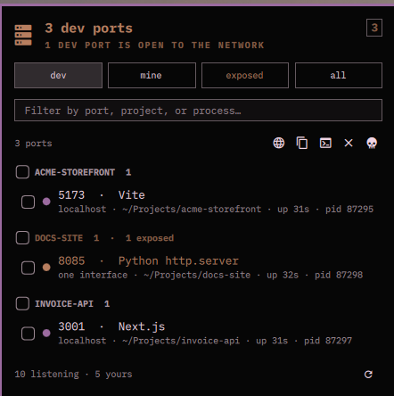

# Omaports

Open dev ports on localhost, in the [Omarchy](https://omarchy.org) bar.

The widget is a count of what you are running. The panel is the list, and its
whole trick is naming things properly: `ss` reports a port as a pid and a
thread name, so a Vite server shows up as `MainThread` and every JavaScript
project on the machine shows up as `node`. Omaports reads the command line,
the working directory and the project root behind each pid, and reports
`3000 · Vite` under the heading `nexahubtech` instead.

From there the actions are the four things anyone actually does with a dev
port: open it, copy it, open a terminal where it lives, or kill it.



## Install

```sh
omarchy plugin add https://github.com/mich-nduka/omaports.git --enable
```

Everything it needs is already on an Omarchy box:

| Dependency | Used for | Required |
|------------|----------|----------|
| `ss` (iproute2) | reading the listening sockets | yes |
| `/proc` | naming the process behind a port | yes |
| `xdg-open` | opening a port in the browser | for the open action |
| `wl-copy` | the copy action | for the copy action |
| `xdg-terminal-exec` | opening a terminal in the project | for the terminal action |

No sudo, no polkit, no daemon. The plugin runs as your user inside
`omarchy-shell` and reads exactly what you could read from a shell. That is
also its one limit: a port owned by another user is visible, but the process
behind it is not, because only root can see whose it is. Those ports are
named from a table of well-known services instead — `5432 · PostgreSQL` —
and never offer a kill.

Nothing here writes to your configuration, and the only thing it ever does to
another process is send it the signal you asked for.

## Remove

```sh
omarchy plugin remove io.github.mich-nduka.omaports
```

That takes the widget out of the bar and deletes the plugin directory. To keep
it installed but off the bar, disable it instead:

```sh
omarchy plugin disable io.github.mich-nduka.omaports
```

Neither leaves anything behind. The only thing this plugin ever writes is its
own entry in `~/.config/omarchy/shell.json`, which `remove` takes with it.

## Usage

Click the icon to open or close the panel. Press Escape to close it.
Right-click refreshes.

The number next to the icon counts dev ports — what you are running, rather
than every socket on the machine. It turns urgent when a dev port is bound
beyond loopback, which is the one thing here worth interrupting you over: a
server on `0.0.0.0` is reachable from every machine on the network you happen
to be on, coffee shop included. Hover for the full count and the reason.

Four chips switch what the list shows.

| Chip | Rows |
|------|------|
| **dev** | ports in a dev range, ports held by a dev runtime, and anything you named in settings |
| **mine** | every port owned by your user, dev or not |
| **exposed** | every port reachable from beyond this machine |
| **all** | everything listening |

Rows are grouped by project — the checkout the server was started from, found
by walking up from its working directory to the nearest `.git`, `package.json`,
`Cargo.toml`, `go.mod`, `composer.json`, `pyproject.toml`, `Gemfile`,
`mix.exs`, `pom.xml`, `build.gradle` or `deno.json`. That is why a Laravel
server started in `public/` lands under the name of the app rather than under
`public`. Ports with no readable owner share one `system` group at the bottom.

Each row reads `port · what it is`, then where it is reachable from, which
checkout it belongs to, how long it has been up, and its pid. The dot on the
left is the summary: accent for a dev port, urgent for a dev port open to the
network, dim for everything else.

A dev server that binds both `127.0.0.1` and `::1` is one row, not two.

### Actions

Tick rows to act on several at once. With nothing ticked, the action applies
to the row under the cursor.

| Action | Icon | Key | What it does |
|--------|------|-----|--------------|
| Open | 󰖟 | `o` | `xdg-open http://localhost:<port>`, for ports that look like they serve HTTP |
| Copy | 󰆏 | `y` | the address, one per line for a multiple selection |
| Terminal | 󰆍 | `t` | `xdg-terminal-exec` in the directory the server runs from |
| Kill | 󰅖 | `x` | the signal set in settings, `TERM` by default |
| Force kill | 󰚌 | `K` | `SIGKILL` |

Kill asks first, unless you turn that off. Only your own processes can be
killed; a row that is not yours leaves the action disabled and says so.

### Keyboard

The panel takes keyboard focus when it opens.

| Key | Does |
|-----|------|
| `↑` `↓` `←` `→` or `hjkl` | move the cursor between chips, the filter field and the list |
| `Return` | tick the row under the cursor, or take the chip under it |
| `/` | jump to the filter field |
| `v` | tick or untick everything visible |
| `1` `2` `3` `4` | dev, mine, exposed, all |
| `r` | refresh |
| `Escape` | close |

Filtering matches the port, the project, the runtime, the process, and the
command line — so `3000`, `vite`, and the name of the checkout all find the
same server.

## Settings

Everything below lives in the widget's entry in
`~/.config/omarchy/shell.json` and can be edited there or from the bar's own
settings panel.

| Setting | Default | What it does |
|---------|---------|--------------|
| `refreshIntervalSec` | `5` | how often the socket table is read |
| `barLabel` | `Dev ports` | the number next to the icon: dev ports, everything, or nothing |
| `warnExposed` | `true` | turn the icon urgent when a dev port is open to the network |
| `showSystemPorts` | `true` | include ports owned by other users |
| `includeUdp` | `false` | include UDP sockets, which are mostly discovery chatter |
| `devPorts` | `""` | extra ports to always count as yours: `7788, 9100-9110` |
| `ignorePorts` | `""` | ports to drop from every list and count |
| `httpsPorts` | `""` | ports whose links should open as `https` |
| `killSignal` | `TERM` | the signal the kill action sends |
| `confirmKill` | `true` | ask before killing |

A port counts as a dev port when it sits in a range dev servers take
(3000-3010, 4200, 5173-5180, 8000-8010, 8080-8090, 19000-19010 and friends),
when the process holding it is a recognised runtime, or when you listed it in
`devPorts`. A well-known service port is deliberately not one: Postgres on
5432 is infrastructure, and counting it would make the number on the bar
useless.

## IPC

The plugin answers on its own IPC target, so a script or a keybinding can
reach it:

```sh
omarchy-shell io.github.mich-nduka.omaports toggle
omarchy-shell io.github.mich-nduka.omaports refresh
omarchy-shell io.github.mich-nduka.omaports count   # 4/11 — dev ports of total
omarchy-shell io.github.mich-nduka.omaports list    # JSON, one object per port
```

`list` is the useful one for scripting:

```sh
omarchy-shell io.github.mich-nduka.omaports list \
  | jq -r '.[] | select(.dev) | "\(.port)\t\(.project)\t\(.name)"'
```

## Development

`Model.js` holds every pure function — the `ss` parser, the /proc merge, the
dev-port classifier, the grouping, and every string the panel shows. It has
no Qt in it, so the whole thing runs under node:

```sh
node test/model-test.js
```

The fixture in that file is a real capture, threaded-runtime naming and all.
`Service.qml` owns every process the plugin starts; `Panel.qml` is
declarative and starts none.

## License

MIT.
